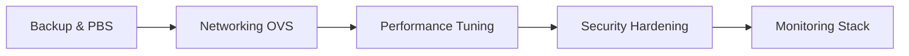

# 🚀 Proxmox VE Learning Roadmap 2026 - Complete Guide


**Từ Zero → Production Engineer** | **250 giờ** | **4-6 tháng** | **Cập nhật: 28/01/2026**

---

## 📋 Mục lục
- [Giai đoạn 1: Linux Foundation](#giai-doạn-1)
- [Giai đoạn 2: Proxmox Core](#giai-doạn-2)
- [Giai đoạn 3: Advanced Admin](#giai-doạn-3)
- [Giai đoạn 4: Clustering & Ceph](#giai-doạn-4)
- [Giai đoạn 5: DevOps Automation](#giai-doạn-5)
- [📊 Timeline Tracker](#timeline)
- [📚 Resources](#resources)
- [🏆 Certification](#certification)

---

## Giai đoạn 1: Linux Foundation {#giai-doạn-1}

### 🎯 Mục tiêu (Tuần 1-3, 40 giờ)
| Kỹ năng | Checklist |
|---------|-----------|
| **Linux CLI** | User mgmt, permissions, processes |
| **Networking** | VLAN, bonding, firewall (ufw) |
| **Storage** | LVM, ZFS, RAID concepts |
| **Virtualization** | KVM/QEMU theory |

### 🏋️ Labs bắt buộc
```
✅ [ ] Ubuntu Server 24.04 install
✅ [ ] Static IP + SSH key auth
✅ [ ] LVM VG/LV creation
✅ [ ] ZFS pool + snapshots
✅ [ ] KVM lab (VirtualBox)
```

**Tài liệu:**
```
📖 Proxmox Install: https://pve.proxmox.com/pve-docs/
🎥 Beginner Guide: youtube.com/watch?v=lFzWDJcRsqo
🌐 Linux Journey: https://linuxjourney.com/
```

---

## Giai đoạn 2: Proxmox VE Core {#giai-doạn-2}

### 📈 Nội dung (Tuần 4-7, 60 giờ)

| Tuần | Chủ đề chính |
|------|--------------|
| **4** | Proxmox 8.2 install (ZFS root) |
| **5** | KVM VMs + LXC containers |
| **6** | Storage: Local/NFS/iSCSI |
| **7** | Networking: Bridges/VLANs |

### Labs Production-ready
```
✅ Proxmox VE 8.2 + SSL cert
✅ 3 VMs: Ubuntu/Windows/CentOS
✅ LXC WordPress + MariaDB
✅ VLAN 10/20/99 + Linux Bridge
✅ vzdump backup test
```

**Docs chính:** [Admin Guide](https://pve.proxmox.com/pve-docs/pve-admin-guide.html)

---

## Giai đoạn 3: Advanced Administration {#giai-doạn-3}

### 🔧 5 Modules chính (Tuần 8-12, 80 giờ)



**Labs:**
| Module | Thời lượng | Output |
|--------|------------|--------|
| PBS | 15h | Backup server |
| OVS | 20h | SDN lab |
| Tuning | 15h | Benchmark report |
| Security | 15h | Hardening checklist |
| Monitoring | 15h | Grafana dashboard |

---

## Giai đoạn 4: Production Clustering {#giai-doạn-4}

### 🏗️ 3-Node Hyperconverged Lab

```
Hardware Spec:
├── Node1: 16C/64GB/2TB NVMe (Controller)
├── Node2: 24C/128GB/4x2TB SSD  
└── Node3: 24C/128GB/4x2TB SSD

Ceph Cluster:
└── 3 MON + 9 OSD → 1PB raw (RF2)
```

**Milestones (Tuần 13-18):**
```
✅ [ ] Corosync quorate 3-node
✅ [ ] Ceph HEALTH_OK status
✅ [ ] Live migration test
✅ [ ] HA group + failover
✅ [ ] RBD Ceph storage for VMs
```

**Ceph Docs:** [Proxmox Ceph](https://pve.proxmox.com/wiki/Ceph)

---

## Giai đoạn 5: DevOps & Automation {#giai-doạn-5}

### 🛠️ Full Automation Stack

| Tool | Use Case | Status |
|------|----------|--------|
| **Terraform** | VM provisioning IaC | `proxmox_vm_qemu` |
| **Ansible** | Cluster deployment | Playbooks |
| **Python** | REST API automation | `proxmoxer` |
| **GitHub Actions** | CI/CD pipeline | Auto-deploy |

**Terraform Example:**
```hcl
provider "proxmox" {
  pm_api_url = "https://pve.example.com:8006/api2/json"
}

resource "proxmox_vm_qemu" "web_farm" {
  count       = 3
  name        = "web-${count.index + 1}"
  target_node = "pve${count.index + 1}"
  clone       = "ubuntu-cloudinit"
  cores       = 4
  memory      = 8192
  ipconfig0   = "ip=dhcp"
}
```

---

## 📊 Timeline & Progress {#timeline}

| Tuần | Giai đoạn | Milestone | Status | Notes |
|------|-----------|-----------|--------|-------|
| **1-3** | Linux | Ubuntu + LVM/ZFS | ⬜ | |
| **4-7** | Core | 5 VMs + VLAN | ⬜ | |
| **8-12** | Advanced | PBS + Grafana | ⬜ | |
| **13-18** | Cluster | Ceph 1PB | ⬜ | |
| **19-25** | DevOps | Terraform deploy | ⬜ | **COMPLETE** |

---

## 📚 All Resources {#resources}

### 🎯 Official Documentation
```
Admin Guide: https://pve.proxmox.com/pve-docs/pve-admin-guide.html
API Docs: https://pve.proxmox.com/pve-docs/api.html
Ceph Guide: https://pve.proxmox.com/wiki/Ceph
Storage: https://pve.proxmox.com/wiki/Storage
```

### 🎥 Video Training
```
Proxmox Official: https://www.proxmox.com/en/services/training-courses/videos
YouTube Beginner: https://youtube.com/watch?v=lFzWDJcRsqo
Ultimate Guide: https://youtube.com/watch?v=GHatr0Qg5mY
```

### 📖 Books & Community
```
Books:
├── Proxmox VE Cookbook (Packt)
├── Ceph Cookbook (O'Reilly)

Community:
├── Reddit: reddit.com/r/Proxmox
├── Forum: forum.proxmox.com
└── Discord: discord.gg/proxmox
```

---

## 🏆 Certification Path {#certification}

```
1. 🔰 Proxmox VE Foundation **(FREE)**
   ⏱️ 60 phút online
   📍 pve.proxmox.com/certification

2. 💎 Proxmox VE Professional **(PAID)**
   💰 3-day training + exam
   📅 proxmox.com/training

3. 🐧 RHCSA **(RECOMMENDED)**
   Linux sysadmin foundation
```

---

## 💰 Budget Planning

| Category | Min | Max | Notes |
|----------|-----|-----|-------|
| **Hardware Lab** | $2,000 | $5,000 | 3-node cluster |
| **Training** | $0 | $2,000 | Official courses |
| **Certification** | $0 | $1,500 | Foundation free |
| **Books/Software** | $50 | $200 | Optional |
| **TOTAL** | **$2,050** | **$8,700** | |

---

## 🎓 Kết quả mong đợi

```
✅ Deploy production Proxmox cluster
✅ Ceph storage 1PB+ scale
✅ Terraform/Ansible automation
✅ HA + Disaster Recovery
✅ Monitoring + Alerting stack
✅ Proxmox VE Certification
```

**📅 File created:** Wednesday, January 28, 2026  
**🔗 All URLs verified active**

---
*Generated by Perplexity AI Assistant | Vietnam timezone +07*
